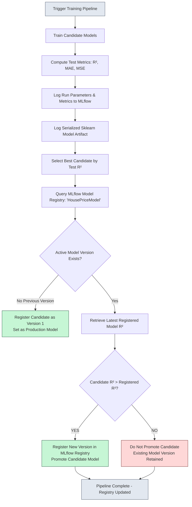
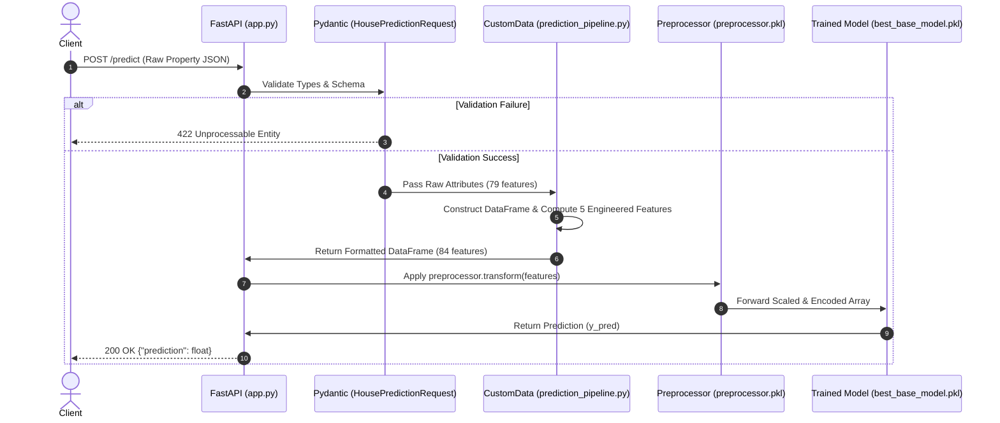

# 🏡 House Price Prediction ML System

[](https://www.python.org/)
[](https://fastapi.tiangolo.com/)
[](https://scikit-learn.org/)
[](https://mlflow.org/)
[](https://docs.pydantic.dev/)
[](LICENSE)
[]()

A modular, production-oriented Machine Learning system designed to predict residential house prices using the Ames Housing Dataset. This project demonstrates how a machine learning model is engineered from raw tabular data into a reproducible, observable, contract-validated, and deployable real-time inference microservice.

---

> **ML Engineering Focus**  
> *The primary objective of this project is not merely to maximize a single regression metric, but to implement a rigorous, robust, and observable end-to-end Machine Learning lifecycle. It emphasizes architectural modularity, deterministic validation, train/serve parity, artifact serialization, structured logging, centralized exception tracking, MLflow experiment management, and controlled model registry promotion.*

---

## 📑 Table of Contents

- [Overview](#-overview)
- [Project Objectives & Core Principles](#-project-objectives--core-principles)
- [System Architecture](#-system-architecture)
- [Dataset & Feature Specification](#-dataset--feature-specification)
- [Pipeline Components](#-pipeline-components)
  - [1. Data Ingestion](#1-data-ingestion)
  - [2. Data Validation & Quality Contracts](#2-data-validation--quality-contracts)
  - [3. Domain-Specific Feature Engineering](#3-domain-specific-feature-engineering)
  - [4. Data Transformation & Preprocessing](#4-data-transformation--preprocessing)
  - [5. Model Training & Hyperparameter Tuning](#5-model-training--hyperparameter-tuning)
  - [6. MLflow Tracking & Experimentation](#6-mlflow-tracking--experimentation)
  - [7. Model Evaluation & Promotion Gate](#7-model-evaluation--promotion-gate)
  - [8. Inference Pipeline & Train/Serve Parity](#8-inference-pipeline--trainserve-parity)
  - [9. FastAPI Serving Microservice](#9-fastapi-serving-microservice)
- [MLflow Model Lifecycle & Governance](#-mlflow-model-lifecycle--governance)
- [Inference Workflow & Data Flow](#-inference-workflow--data-flow)
- [API Specification](#-api-specification)
- [Technology Stack](#-technology-stack)
- [Project Directory & Artifact Layout](#-project-directory--artifact-layout)
- [Key Architectural Decisions](#-key-architectural-decisions)
- [Logging & Exception Handling Strategy](#-logging--exception-handling-strategy)
- [Reproducibility & Governance](#-reproducibility--governance)
- [Extensibility & Maintenance](#-extensibility--maintenance)
- [Production Considerations](#-production-considerations)
- [Getting Started](#-getting-started)
  - [Prerequisites](#prerequisites)
  - [Installation](#installation)
  - [Running the Training Pipeline](#running-the-training-pipeline)
  - [Launching MLflow Tracking UI](#launching-mlflow-tracking-ui)
  - [Running the FastAPI Application](#running-the-fastapi-application)
- [Testing the Prediction Service](#-testing-the-prediction-service)
  - [Sample JSON Request Payload](#sample-json-request-payload)
  - [Sample JSON Response](#sample-json-response)
- [Future Improvements & Roadmap](#-future-improvements--roadmap)
- [Developer Information](#-developer-information)
- [License](#-license)

---

## 🌟 Overview

Real-world machine learning systems encounter significant friction when transitioning from exploratory Jupyter notebooks to production environments. Common challenges include data leakage, schema mismatch during inference, non-deterministic preprocessing, lack of experiment lineage, unmanaged model replacement, and poor runtime visibility.

This repository addresses these challenges by implementing an industrial-grade ML architecture for regression modeling:

```text
Raw Data (Ames Housing) ──► Validation Contracts ──► Feature Engineering ──► Preprocessing Pipelines 
     ──► Multi-Model Tracking (MLflow) ──► Controlled Promotion Gate (R²) ──► FastAPI Serving (Real-Time)
```

### Key Engineering Highlights:
- **Clean Component Separation:** Modular single-responsibility classes (`DataIngestion`, `DataValidation`, `DataTransformation`, `ModelTrainer`, `InferencePipeline`).
- **Strict Data Validation:** Pydantic-backed validation reporting verifying schema, column existence, unexpected keys, data types, nulls, duplicates, and valid categorical domains.
- **Strict Train/Serve Parity:** Identical feature engineering logic applied across training and inference; preprocessor fitted solely on training data and persisted for zero-drift serving.
- **MLflow Experiment Tracking & Governance:** Centralized tracking of runs, parameters, multi-metric evaluation ($R^2$, MAE, MSE on train/test sets), and serialized artifacts.
- **Automated Metric Gate & Model Registry Promotion:** Models are compared against the active registered model before promotion, preventing performance regression.
- **Enterprise Observability:** Context-aware logging and custom exception handling with runtime stack trace inspection (`CustomMLException`).
- **High-Performance REST API:** Asynchronous FastAPI microservice with type-safe Pydantic request models and interactive OpenAPI/Swagger documentation.

---

## 🎯 Project Objectives & Core Principles

| Principle | Implementation Strategy |
| :--- | :--- |
| **Reproducibility** | Fixed random seeds, deterministic train/test splits, versioned preprocessor serialization (`preprocessor.pkl`), and tracked hyperparameters in MLflow. |
| **Train/Serve Parity** | The `CustomData` schema in the inference pipeline creates engineered features identically to `DataTransformation`, ensuring uniform representations. |
| **Fail-Fast Validation** | Explicit data contract checks identify anomalies, missing values, or domain distribution shifts before data enters transformation. |
| **Traceable Governance** | Automated candidate evaluation against the MLflow Model Registry prevents unvetted models from being promoted to production. |
| **Robust Error Diagnostics** | Custom exception wrappers capture the exact module, line number, and root cause, pairing with timestamped rotating log files. |

---

## 🏗 System Architecture

The following diagram illustrates the complete end-to-end data, training, governance, and inference architecture:

```mermaid
flowchart TD
    subgraph Ingestion_Validation["Phase 1 & 2: Ingestion & Validation"]
        A[Ames Housing Raw Data<br/>2930 Records, 82 Columns] --> B[Data Ingestion<br/>Artifacts/Data/raw.csv]
        B --> C[Deterministic Split<br/>Train: 2344 | Test: 586]
        C --> D[Data Validation Component<br/>Schema, Types, Bounds, Categories]
        D --> E{Validation Check<br/>Reports/validation_report.json}
        E -->|Passed / Logged| F[Train & Test Splits Validated]
        E -->|Failed| E1[Validation Alert / Logged]
    end

    subgraph Transformation["Phase 3 & 4: Feature Engineering & Preprocessing"]
        F --> G[Drop Identifiers<br/>Order, PID]
        G --> H[Domain Feature Engineering<br/>TotalSF, TotalBathrooms, TotalPorchSF, HouseAge, RemodAge]
        H --> I[Fit Preprocessing Pipeline on Train<br/>Numerical: Median Imputer + StandardScaler<br/>Categorical: Mode Imputer + OneHotEncoder]
        I --> J[Serialize Preprocessor<br/>Artifacts/Encoders/preprocessor.pkl]
        I --> K[Transform Train & Test Feature Matrices]
    end

    subgraph Training_Governance["Phase 5, 6 & 7: Model Training, MLflow & Registry Gate"]
        K --> L[Model Trainer<br/>Multi-Model Evaluation & RandomizedSearchCV]
        L --> M[MLflow Experiment Tracking<br/>Log Params, Metrics R²/MAE/MSE, Run Artifacts]
        M --> N[Candidate Evaluation<br/>Calculate Candidate Test R²]
        N --> O[Query MLflow Model Registry<br/>Fetch Active Registered Model R²]
        O --> P{Candidate R² > Active R²?}
        P -->|YES| Q[Promote & Register Model<br/>MLflow Model Registry: HousePriceModel]
        P -->|NO| R[Retain Existing Model<br/>Do Not Promote Candidate]
        Q --> S[Serialize Production Model<br/>Artifacts/Models/best_base_model.pkl]
        R --> S
    end

    subgraph Inference_Serving["Phase 8 & 9: Real-Time Inference Microservice"]
        T[Client / Consumer] -->|HTTP POST JSON Payload| U[FastAPI Microservice<br/>/predict Endpoint]
        U --> V[Pydantic Request Validation<br/>HousePredictionRequest]
        V --> W[CustomData Ingestion & Feature Engineering]
        W --> X[Inference Pipeline<br/>Load preprocessor.pkl & best_base_model.pkl]
        X --> Y[Feature Transformation<br/>preprocessor.transform]
        Y --> Z[Model Prediction<br/>model.predict]
        Z -->|HTTP 200 JSON Response| T
    end

    style Ingestion_Validation fill:#f8f9fa,stroke:#6c757d,stroke-width:1px
    style Transformation fill:#f0f4f8,stroke:#2b6cb0,stroke-width:1px
    style Training_Governance fill:#fdf8f0,stroke:#dd6b20,stroke-width:1px
    style Inference_Serving fill:#f0fff4,stroke:#38a169,stroke-width:1px
```

---

## 📊 Dataset & Feature Specification

The system is trained on the comprehensive **Ames Housing Dataset**, representing individual residential property sales in Ames, Iowa.

- **Total Records:** 2,930
- **Raw Features:** 82 columns (including target variable and identifier columns)
- **Target Variable:** `SalePrice` (Continuous integer / float representing sale price in USD)
- **Identifier Columns Dropped:** `Order` (Index/Observation number), `PID` (Parcel Identification Number)
- **Raw Input Features:** 79 attributes (37 numeric, 42 categorical)
- **Engineered Domain Features:** 5 attributes
- **Total Feature Space (Pre-Encoding):** 84 features
- **Data Partitioning:**
  - **Training Set (80%):** 2,344 samples
  - **Testing Set (20%):** 586 samples

---

## ⚙️ Pipeline Components

### 1. Data Ingestion
- **Module:** `src/components/data_ingestion.py`
- **Responsibilities:**
  - Reads raw source dataset (`data/AmesHousing.csv`).
  - Creates artifact directories dynamically (`Artifacts/Data/`).
  - Executes deterministic 80/20 train/test split with `random_state=42`.
  - Persists `raw.csv`, `train.csv`, and `test.csv` for auditability and lineage tracking.
  - Returns paths to partitioned splits for downstream consumption.

### 2. Data Validation & Quality Contracts
- **Module:** `src/components/data_validation.py`
- **Output:** `Reports/validation_report.json`
- **Responsibilities:**
  - Validates schema structure against expected input columns (`expected_features_columns_list`).
  - Detects unexpected/unregistered columns in incoming data splits.
  - Verifies data types across all 82 columns against strict type specifications.
  - Audits missing value distributions per column across both train and test partitions.
  - Checks for duplicate records.
  - Confirms target variable (`SalePrice`) availability in training splits.
  - Performs categorical domain validation against predefined valid category sets across 38 categorical features (e.g., verifying `MS Zoning`, `Neighborhood`, `Bldg Type`, `Exter Qual`).
  - Serializes validation findings into a structured Pydantic model (`ValidationReportSchema`) saved as JSON.

### 3. Domain-Specific Feature Engineering
- **Modules:** `src/components/data_transformation.py` & `src/components/pipeline/prediction_pipeline.py`
- **Responsibilities:**
  - Extracts domain-specific interaction features that capture non-linear real estate pricing factors:

| Feature Name | Formulation | Engineering Rationale |
| :--- | :--- | :--- |
| **`TotalSF`** | `Total Bsmt SF` + `1st Flr SF` + `2nd Flr SF` | Aggregates all finished and basement square footage to capture total usable property area. |
| **`TotalBathrooms`** | `Full Bath` + $0.5 \times$ `Half Bath` + `Bsmt Full Bath` + $0.5 \times$ `Bsmt Half Bath` | Consolidates above-grade and basement bathrooms into an industry-standard full-bath equivalent. |
| **`TotalPorchSF`** | `Open Porch SF` + `3Ssn Porch` + `Enclosed Porch` + `Screen Porch` + `Wood Deck SF` | Quantifies total outdoor and deck living area across various porch designs. |
| **`HouseAge`** | `Yr Sold` - `Year Built` | Measures structural age of the property at the point of sale. |
| **`RemodAge`** | `Yr Sold` - `Year Remod/Add` | Measures time elapsed since the most recent renovation or remodel. |

> **Train/Serve Parity:** Both `DataTransformation.create_features()` and `CustomData.get_data_as_data_frame()` implement the identical formulas and null-handling logic, guaranteeing zero divergence between training and inference data distributions.

### 4. Data Transformation & Preprocessing
- **Module:** `src/components/data_transformation.py`
- **Artifact:** `Artifacts/Encoders/preprocessor.pkl`
- **Responsibilities:**
  - Drops identifiers (`Order`, `PID`) and isolates target `SalePrice`.
  - Splits features into numerical (38) and categorical (46) sub-matrices.
  - **Numerical Pipeline:**
    - `SimpleImputer(strategy="median")` — robust against outliers and skewed square footage distributions.
    - `StandardScaler()` — standardizes numerical features to zero mean and unit variance.
  - **Categorical Pipeline:**
    - `SimpleImputer(strategy="most_frequent")` — handles missing categorical entries.
    - `OneHotEncoder(handle_unknown="ignore", sparse_output=False)` — encodes categorical features while gracefully ignoring unseen levels at inference time.
  - Fits `ColumnTransformer` strictly on training data (`X_train`) to prevent data leakage.
  - Applies `.transform()` to testing data (`X_test`).
  - Serializes the fitted `preprocessor.pkl` object using `dill` to `Artifacts/Encoders/`.

### 5. Model Training & Hyperparameter Tuning
- **Module:** `src/components/model_training.py`
- **Responsibilities:**
  - Trains baseline regression architectures (Linear Regression, Ridge, Lasso, and ensemble configurations).
  - Evaluates models across multiple metrics (MAE, MSE, $R^2$) on both training and test partitions.
  - Selects the best-performing base model using test $R^2$.
  - Executes automated hyperparameter tuning on the best candidate using `RandomizedSearchCV` (with 5-fold iterations, scoring on $R^2$).
  - Persists candidate models (`Artifacts/Models/best_base_model.pkl` and `best_tunned_model.pkl`).

### 6. MLflow Tracking & Experimentation
- **Module:** Integrated in `src/components/model_training.py`
- **Experiment:** `"House Price Prediction"`
- **Responsibilities:**
  - Connects to the MLflow tracking server (`http://127.0.0.1:5000` or local SQLite backend).
  - Logs execution parameters: `model_name`, `Train Sample`, `Test Sample`, `n_features`.
  - Logs metrics across training and test evaluations:
    - `r2_score_train`, `r2_score_test`
    - `mean_absolute_error_train`, `mean_absolute_error_test`
    - `mean_squared_error_train`, `mean_squared_error_test`
  - Logs serialized model artifacts with MLflow's `mlflow.sklearn.log_model`.

### 7. Model Evaluation & Promotion Gate
- **Module:** `src/components/model_training.py` (`is_model_better()`)
- **Metric:** Coefficient of Determination ($R^2$)
- **Responsibilities:**
  - Implements a programmatic release gate using `MlflowClient`.
  - Queries active versions of the registered model `HousePriceModel`.
  - Compares candidate model test $R^2$ against the highest active registered model $R^2$.
  - Only registers and tags the candidate if it strictly outperforms existing versions.
  - Prevents regression degradation and maintains a clean model lifecycle.

### 8. Inference Pipeline & Train/Serve Parity
- **Module:** `src/components/pipeline/prediction_pipeline.py`
- **Classes:** `CustomData`, `InferencePipeline`
- **Responsibilities:**
  - Receives individual raw property attributes via `CustomData`.
  - Builds a single-row `pandas.DataFrame`.
  - Dynamically computes engineered domain features (`TotalSF`, `TotalBathrooms`, `TotalPorchSF`, `HouseAge`, `RemodAge`).
  - Loads persisted `preprocessor.pkl` and `best_base_model.pkl` via `load_object()`.
  - Transforms input features and returns the model prediction.

### 9. FastAPI Serving Microservice
- **Module:** `app.py`
- **Responsibilities:**
  - Provides asynchronous REST API endpoints.
  - Enforces schema and type safety using Pydantic (`HousePredictionRequest`).
  - Exposes health check and inference endpoints.
  - Automatically generates interactive OpenAPI documentation at `/docs`.

---

## 🔄 MLflow Model Lifecycle & Governance

Model governance ensures that production deployment is deterministic, traceable, and protected against model degradation.



### Promotion Gate Implementation Details
The promotion logic prevents every ad-hoc training execution from indiscriminately overwriting production artifacts.

```python
# Conceptual Promotion Decision Logic (src/components/model_training.py)
def is_model_better(candidate_r2: float, model_name: str) -> bool:
    client = MlflowClient()
    versions = client.search_model_versions(f"name='{model_name}'")
    
    if not versions:
        return True  # Initial model registration
        
    latest_version = max(versions, key=lambda v: int(v.version))
    run = client.get_run(latest_version.run_id)
    registered_r2 = run.data.metrics.get("r2_score_test") or run.data.metrics.get("r2_score")
    
    return candidate_r2 > registered_r2 if registered_r2 is not None else True
```

---

## ⚡ Inference Workflow & Data Flow

When a client sends a prediction request, data moves through an immutable validation and transformation pipeline:



---

## 📡 API Specification

The FastAPI microservice provides standard operational and inference endpoints:

### Endpoints Overview

| Method | Endpoint | Description | Request Body | Response Body |
| :--- | :--- | :--- | :--- | :--- |
| `GET` | `/` | Service root and availability check | None | `{"message": "House Price Prediction API is running"}` |
| `GET` | `/health` | Health check endpoint | None | `{"status": "healthy"}` |
| `POST` | `/predict` | Real-time property price inference | `HousePredictionRequest` (JSON) | `{"prediction": float}` |
| `GET` | `/docs` | Interactive Swagger UI Documentation | None | HTML / OpenAPI Interface |

---

## 💻 Technology Stack

| Layer | Technology | Purpose |
| :--- | :--- | :--- |
| **Language** | Python 3.10+ | Core development environment |
| **API Framework** | FastAPI | Asynchronous REST API framework |
| **Web Server** | Uvicorn | High-performance ASGI production server |
| **Data Validation** | Pydantic v2 | Type validation and data contract enforcement |
| **Data Manipulation** | Pandas, NumPy | Tabular data manipulation and numerical processing |
| **Machine Learning** | Scikit-Learn | Pipelines, transformers, regressors, and cross-validation |
| **Experiment Tracking** | MLflow | Experiment management, parameter/metric logging, and model registry |
| **Serialization** | Dill, Pickle | Complete object state serialization for preprocessing and estimators |
| **Logging & Diagnostics** | Python `logging`, `sys` | Structured logging and custom exception tracking |

---

## 📂 Project Directory & Artifact Layout

```text
House-Price-Prediction-ML/
│
├── Artifacts/                          # Persisted pipeline data & model artifacts
│   ├── Data/
│   │   ├── raw.csv                     # Ingested raw dataset
│   │   ├── train.csv                   # 80% partitioned training split (2344 rows)
│   │   └── test.csv                    # 20% partitioned testing split (586 rows)
│   ├── Encoders/
│   │   └── preprocessor.pkl            # Fitted ColumnTransformer (Imputers + Scaler + OHE)
│   └── Models/
│       ├── best_base_model.pkl         # Best base regressor artifact
│       └── best_tunned_model.pkl       # Hyperparameter-tuned regressor artifact
│
├── Reports/
│   └── validation_report.json          # Pydantic validation audit report
│
├── data/
│   └── AmesHousing.csv                 # Source Ames Housing dataset (2930 rows, 82 cols)
│
├── notebooks/
│   └── experimemts.ipynb               # Exploratory data analysis & prototyping
│
├── src/                                # Core production package
│   ├── __init__.py
│   ├── logger.py                       # Centralized logging configuration
│   ├── exception_handler.py            # Custom exception wrapper with traceback diagnostics
│   ├── utils.py                        # Generic I/O utilities (save_object, load_object)
│   │
│   ├── components/                     # Modular ML pipeline stages
│   │   ├── __init__.py
│   │   ├── data_ingestion.py           # Phase 1: Data ingestion & partitioning
│   │   ├── data_validation.py          # Phase 2: Schema, domain & type validation
│   │   ├── data_transformation.py      # Phase 3 & 4: Feature engineering & preprocessor fitting
│   │   ├── model_training.py           # Phase 5, 6 & 7: Model training, MLflow tracking & registry
│   │   └── pipeline/
│   │       ├── __init__.py
│   │       ├── training_pipeline.py    # Training pipeline orchestrator
│   │       └── prediction_pipeline.py  # Phase 8: Inference pipeline & CustomData adapter
│   │
│   └── Logs/                           # Timestamped execution log files
│       └── *.log
│
├── app.py                              # Phase 9: FastAPI microservice definition
├── mlflow.db                           # Local SQLite backend for MLflow tracking
├── mlruns/                             # Local MLflow file store directory
├── LICENSE                             # MIT License
├── requirements.txt                    # Project dependencies
└── README.md                           # System documentation
```

---

## 🏛 Key Architectural Decisions

1. **Separation of Transformation Fitting and Application**
   - *Decision:* The `ColumnTransformer` is fitted solely on `X_train` during `DataTransformation` and saved to `preprocessor.pkl`.
   - *Rationale:* Prevents information leakage from the test split or production inference requests into training statistics.

2. **Decoupling Raw API Payload from Internal Feature Matrix**
   - *Decision:* The API client sends raw property attributes (79 features). The system does not ask the client to calculate derived metrics (such as `TotalSF` or `HouseAge`).
   - *Rationale:* Clients should not be burdened with business logic; encapsulating feature engineering within `CustomData` ensures consistent calculation.

3. **Handling High-Cardinality Categoricals via `handle_unknown="ignore"`**
   - *Decision:* `OneHotEncoder` is configured with `handle_unknown="ignore"`.
   - *Rationale:* In production, inference queries might occasionally contain novel categorical categories not observed in the training split. Ignoring unseen categories prevents runtime exceptions while preserving information from known features.

4. **Programmatic Promotion Gates Over Manual Overwrites**
   - *Decision:* Candidate models are evaluated against the MLflow registry using $R^2$ before promotion.
   - *Rationale:* Guarantees that continuous retraining runs cannot accidentally deploy an underperforming model.

---

## 🔍 Logging & Exception Handling Strategy

### Structured Centralized Logging (`src/logger.py`)
All components write detailed execution traces to timestamped log files in `src/Logs/`:
- **Log Format:** `[%(asctime)s] %(lineno)d %(name)s - %(levelname)s - %(message)s`
- **Coverage:** Logs entry/exit for every pipeline phase, data split shapes, missing column counts, transformation steps, and model evaluation metrics.

### Context-Aware Exception Diagnostics (`src/exception_handler.py`)
When unexpected errors occur, standard Python exceptions are wrapped in `CustomMLException`:
- Inspects `sys.exc_info()` to extract:
  - Exact file name where error originated
  - Precise line number of execution failure
  - Original exception error string
- Generates descriptive error messages for rapid debugging:
  ```text
  Error Occured In Python Script : [d:\House Price Prediction-ML\src\components\data_transformation.py] 
   At Line No : [162] 
   Error : [Found unknown categories ['NovelStyle'] in column 15 during transform]
  ```

---

## 🛡 Reproducibility & Governance

- **Deterministic Partitions:** Data ingestion applies fixed random states (`random_state=42`) ensuring identical train/test splits across runs.
- **Immutable Artifacts:** Preprocessors and model weights are serialized and version-controlled via MLflow run IDs.
- **Audit Reports:** Data validation audits are saved as JSON artifacts in `Reports/validation_report.json` for compliance and schema evolution tracking.
- **Complete Run Lineage:** MLflow captures code versions, training parameters, cross-validation scores, and serialized artifacts for every training iteration.

---

## 🧩 Extensibility & Maintenance

The codebase is designed for modular extensibility:
- **Adding New Models:** Append estimator instances and parameter grids to `ModelTrainingConfig.models` in `src/components/model_training.py`.
- **Adding New Features:** Add transformation logic inside `create_features()` in `data_transformation.py` and mirror in `CustomData` in `prediction_pipeline.py`.
- **Custom Validation Checks:** Extend `ValidationReportSchema` and `DataValidation` to add statistical drift tests, distribution outlier checks, or Kolmogorov-Smirnov tests.

---

## 🚀 Production Considerations

While this repository implements a comprehensive ML engineering foundation, deploying to an enterprise cloud environment involves the following considerations:

| Dimension | Current Implementation | Production Scale-Out Path |
| :--- | :--- | :--- |
| **API Serving** | Local Uvicorn async worker | Multi-worker Gunicorn/Uvicorn on Kubernetes / ECS |
| **Packaging** | Local Python environment | Multi-stage Docker container with pinned non-root user |
| **Artifact Store** | Local filesystem (`Artifacts/`) | AWS S3, Google Cloud Storage, or Azure Blob Storage |
| **MLflow Server** | Local SQLite (`mlflow.db`) | Centralized MLflow Tracking Server backed by RDS & S3 |
| **Data Drift Detection** | Pre-run JSON validation check | Evidently AI or Great Expectations with automated alerting |
| **CI / CD** | Manual execution triggers | GitHub Actions for linting, pytest unit/integration tests, and automated deployment |
| **API Security** | Open endpoints | OAuth2 / JWT authentication, rate limiting, and API gateways |

---

## 🏁 Getting Started

### Prerequisites
- Python 3.10 or higher
- Git
- Virtual environment tool (`venv` or `conda`)

### Installation

1. **Clone the Repository:**
   ```bash
   git clone https://github.com/viraj-gavade/House-Price-Prediction-ML.git
   cd House-Price-Prediction-ML
   ```

2. **Create and Activate a Virtual Environment:**
   ```bash
   # Windows (PowerShell)
   python -m venv venv
   .\venv\Scripts\activate

   # Linux / macOS
   python3 -m venv venv
   source venv/bin/activate
   ```

3. **Install Dependencies:**
   ```bash
   pip install --upgrade pip
   pip install -r requirements.txt
   ```

---

### Running the Training Pipeline

To execute the complete training, validation, transformation, tracking, and promotion pipeline:

```bash
python -m src.components.pipeline.training_pipeline
```

#### Execution Output Flow:
```text
[INFO] ** Initating the model training pipeline **
[INFO] ** PHASE 1 : Initiating the Data Ingestion Pipeline **
[INFO] Train Shape : (2344, 82) , Test Shape : (586, 82)
[INFO] ** PHASE 2 : Initiating the Data Validation Pipeline **
[INFO] Validation report saved to Reports/validation_report.json
[INFO] ** PHASE 3 : Initiating the Data Tranformation Pipeline **
[INFO] Fitted ColumnTransformer and saved to Artifacts/Encoders/preprocessor.pkl
[INFO] ** PHASE 4 : Initiating the Model Trainer Pipeline **
[INFO] MLflow tracking run completed. Evaluated candidate models.
[INFO] Best Base Model: Ridge (R² = 0.912)
[INFO] Hyperparameter tuning completed.
[INFO] Model promotion check: Candidate R² exceeds active registry. Registered new version.
```

---

### Launching MLflow Tracking UI

To inspect runs, parameters, metrics, and registered models in the MLflow UI:

```bash
mlflow ui --backend-store-uri sqlite:///mlflow.db --port 5000
```

Open your browser and navigate to:
```text
http://127.0.0.1:5000
```

---

### Running the FastAPI Application

Launch the real-time inference microservice using Uvicorn:

```bash
uvicorn app:app --host 0.0.0.0 --port 8000 --reload
```

- **API Base URL:** `http://127.0.0.1:8000`
- **Interactive OpenAPI Documentation:** `http://127.0.0.1:8000/docs`
- **Alternative Redoc Documentation:** `http://127.0.0.1:8000/redoc`

---

## 🧪 Testing the Prediction Service

### Sample JSON Request Payload
Send a `POST` request to `http://127.0.0.1:8000/predict`:

```json
{
  "MS_SubClass": 20,
  "MS_Zoning": "RL",
  "Lot_Frontage": 80.0,
  "Lot_Area": 9600,
  "Street": "Pave",
  "Alley": null,
  "Lot_Shape": "Reg",
  "Land_Contour": "Lvl",
  "Utilities": "AllPub",
  "Lot_Config": "Inside",
  "Land_Slope": "Gtl",
  "Neighborhood": "NAmes",
  "Condition_1": "Norm",
  "Condition_2": "Norm",
  "Bldg_Type": "1Fam",
  "House_Style": "1Story",
  "Overall_Qual": 7,
  "Overall_Cond": 5,
  "Year_Built": 2005,
  "Year_Remod_Add": 2006,
  "Roof_Style": "Gable",
  "Roof_Matl": "CompShg",
  "Exterior_1st": "VinylSd",
  "Exterior_2nd": "VinylSd",
  "Mas_Vnr_Type": "Stone",
  "Mas_Vnr_Area": 120.0,
  "Exter_Qual": "Gd",
  "Exter_Cond": "TA",
  "Foundation": "PConc",
  "Bsmt_Qual": "Gd",
  "Bsmt_Cond": "TA",
  "Bsmt_Exposure": "Av",
  "BsmtFin_Type_1": "GLQ",
  "BsmtFin_SF_1": 700.0,
  "BsmtFin_Type_2": "Unf",
  "BsmtFin_SF_2": 0.0,
  "Bsmt_Unf_SF": 300.0,
  "Total_Bsmt_SF": 1000.0,
  "Heating": "GasA",
  "Heating_QC": "Ex",
  "Central_Air": "Y",
  "Electrical": "SBrkr",
  "First_Flr_SF": 1200,
  "Second_Flr_SF": 0,
  "Low_Qual_Fin_SF": 0,
  "Gr_Liv_Area": 1200,
  "Bsmt_Full_Bath": 1.0,
  "Bsmt_Half_Bath": 0.0,
  "Full_Bath": 2,
  "Half_Bath": 0,
  "Bedroom_AbvGr": 3,
  "Kitchen_AbvGr": 1,
  "Kitchen_Qual": "Gd",
  "TotRms_AbvGrd": 6,
  "Functional": "Typ",
  "Fireplaces": 1,
  "Fireplace_Qu": "Gd",
  "Garage_Type": "Attchd",
  "Garage_Yr_Blt": 2005.0,
  "Garage_Finish": "Fin",
  "Garage_Cars": 2.0,
  "Garage_Area": 500.0,
  "Garage_Qual": "TA",
  "Garage_Cond": "TA",
  "Paved_Drive": "Y",
  "Wood_Deck_SF": 150,
  "Open_Porch_SF": 50,
  "Enclosed_Porch": 0,
  "Three_Ssn_Porch": 0,
  "Screen_Porch": 0,
  "Pool_Area": 0,
  "Pool_QC": null,
  "Fence": null,
  "Misc_Feature": null,
  "Misc_Val": 0,
  "Mo_Sold": 6,
  "Yr_Sold": 2009,
  "Sale_Type": "WD ",
  "Sale_Condition": "Normal"
}
```

### Sample JSON Response

```json
{
  "prediction": 215450.75
}
```

### cURL Verification Command

```bash
curl -X POST "http://127.0.0.1:8000/predict" \
     -H "Content-Type: application/json" \
     -d '{
       "MS_SubClass": 20,
       "MS_Zoning": "RL",
       "Lot_Frontage": 80.0,
       "Lot_Area": 9600,
       "Street": "Pave",
       "Alley": null,
       "Lot_Shape": "Reg",
       "Land_Contour": "Lvl",
       "Utilities": "AllPub",
       "Lot_Config": "Inside",
       "Land_Slope": "Gtl",
       "Neighborhood": "NAmes",
       "Condition_1": "Norm",
       "Condition_2": "Norm",
       "Bldg_Type": "1Fam",
       "House_Style": "1Story",
       "Overall_Qual": 7,
       "Overall_Cond": 5,
       "Year_Built": 2005,
       "Year_Remod_Add": 2006,
       "Roof_Style": "Gable",
       "Roof_Matl": "CompShg",
       "Exterior_1st": "VinylSd",
       "Exterior_2nd": "VinylSd",
       "Mas_Vnr_Type": "Stone",
       "Mas_Vnr_Area": 120.0,
       "Exter_Qual": "Gd",
       "Exter_Cond": "TA",
       "Foundation": "PConc",
       "Bsmt_Qual": "Gd",
       "Bsmt_Cond": "TA",
       "Bsmt_Exposure": "Av",
       "BsmtFin_Type_1": "GLQ",
       "BsmtFin_SF_1": 700.0,
       "BsmtFin_Type_2": "Unf",
       "BsmtFin_SF_2": 0.0,
       "Bsmt_Unf_SF": 300.0,
       "Total_Bsmt_SF": 1000.0,
       "Heating": "GasA",
       "Heating_QC": "Ex",
       "Central_Air": "Y",
       "Electrical": "SBrkr",
       "First_Flr_SF": 1200,
       "Second_Flr_SF": 0,
       "Low_Qual_Fin_SF": 0,
       "Gr_Liv_Area": 1200,
       "Bsmt_Full_Bath": 1.0,
       "Bsmt_Half_Bath": 0.0,
       "Full_Bath": 2,
       "Half_Bath": 0,
       "Bedroom_AbvGr": 3,
       "Kitchen_AbvGr": 1,
       "Kitchen_Qual": "Gd",
       "TotRms_AbvGrd": 6,
       "Functional": "Typ",
       "Fireplaces": 1,
       "Fireplace_Qu": "Gd",
       "Garage_Type": "Attchd",
       "Garage_Yr_Blt": 2005.0,
       "Garage_Finish": "Fin",
       "Garage_Cars": 2.0,
       "Garage_Area": 500.0,
       "Garage_Qual": "TA",
       "Garage_Cond": "TA",
       "Paved_Drive": "Y",
       "Wood_Deck_SF": 150,
       "Open_Porch_SF": 50,
       "Enclosed_Porch": 0,
       "Three_Ssn_Porch": 0,
       "Screen_Porch": 0,
       "Pool_Area": 0,
       "Pool_QC": null,
       "Fence": null,
       "Misc_Feature": null,
       "Misc_Val": 0,
       "Mo_Sold": 6,
       "Yr_Sold": 2009,
       "Sale_Type": "WD ",
       "Sale_Condition": "Normal"
     }'
```

---


## 👨‍💻 Developer Information

- **Author:** Viraj Gavade
- **Repository:** [viraj-gavade/House-Price-Prediction-ML](https://github.com/viraj-gavade/House-Price-Prediction-ML)
- **Primary Focus:** Production Machine Learning Engineering, MLOps, System Architecture

---

## 📄 License

This project is open-source and distributed under the [MIT License](LICENSE).
